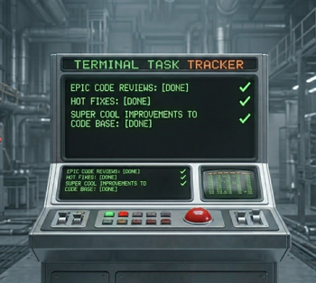

# Terminal Task Tracker

<div align="left" dir="auto">
  
</div>

A small Go CLI for managing a todo list from the terminal. Tasks are persisted to a CSV file with an exclusive `flock` lock so concurrent invocations don't corrupt the data.

## Pre-requisites

- A Unix-like OS (macOS, Linux, BSD).
- Go 1.25 or newer

## Install

The recommended way is go install, which compiles the binary and drops it into your Go bin directory automatically:

```sh
https://github.com/code-qtzl/Terminal-Task-Tracker.git
cd Terminal-Task-Tracker
go install .
```

This installs tasks to $(go env GOBIN) if set, otherwise $(go env GOPATH)/bin. Make sure that directory is on your $PATH so you can run tasks from anywhere.

If you'd prefer to build a local binary without installing it globally:

```sh
go build -o tasks .
```

Then drop the resulting `tasks` binary somewhere on your `$PATH` (e.g. `~/bin` or `/usr/local/bin`).

## Data file

By default, tasks are stored in `~/.tasks.csv`. Override the location with either:

- `--file /path/to/file.csv` (or `-f`) on any command
- `TASKS_FILE=/path/to/file.csv` in your environment

The file is created automatically on first use.

## Commands

### `tasks add <description>`

Add a new task. The description must be quoted if it contains spaces.

```sh
$ tasks add "Build Go Project"
Added task 1
```

### `tasks list [-a|--all]` (alias: `tasks ls`)

List tasks. By default, only uncompleted tasks are shown. `ls` is a shorthand alias for `list` — they behave identically.

```sh
$ tasks ls
ID    Task                                                Created
1     Build Go Project                                    a minute ago
3     Review PR for open-source project                   a few seconds ago
```

Pass `-a` / `--all` to include completed tasks (adds a `Done` column):

```sh
$ tasks ls -a
ID    Task                                                Created          Done
1     Build Go Project                                    2 minutes ago    false
2     Write up documentation for new project feature      a minute ago     true
3     Review PR for open-source project                   a minute ago     false
```

### `tasks done <id>`

Mark a task as done.

```sh
$ tasks done 2
Marked task 2 as done
```

### `tasks delete <id>`

Remove a task from the data file.

```sh
$ tasks delete 1
Deleted task 1
```

## Behavior notes

- IDs are monotonically increasing — deleting a task does not reuse its ID.
- All normal output goes to **stdout**; errors and diagnostics go to **stderr**. Failures exit non-zero.
- The CSV file is locked exclusively (`flock LOCK_EX`) for the lifetime of each command, so two `tasks` processes running at once will serialize their reads/writes safely.

## CSV format

```
ID,Description,CreatedAt,IsComplete
1,My new task,2024-07-27T16:45:19-05:00,true
2,Finish this go project,2024-07-27T16:45:26-05:00,true
3,Find a open-source project to contribute to,2024-07-27T16:45:31-05:00,false
```

Timestamps are RFC3339.

## Project layout

```
GO-Todo/
├── main.go
├── cmd/                 # cobra commands (root, add, list, complete, delete)
└── internal/store/      # Task model, CSV load/save, flock helpers
```

## Dependencies

- [`github.com/spf13/cobra`](https://github.com/spf13/cobra) — CLI framework
- [`github.com/mergestat/timediff`](https://github.com/mergestat/timediff) — relative time formatting ("a minute ago")
